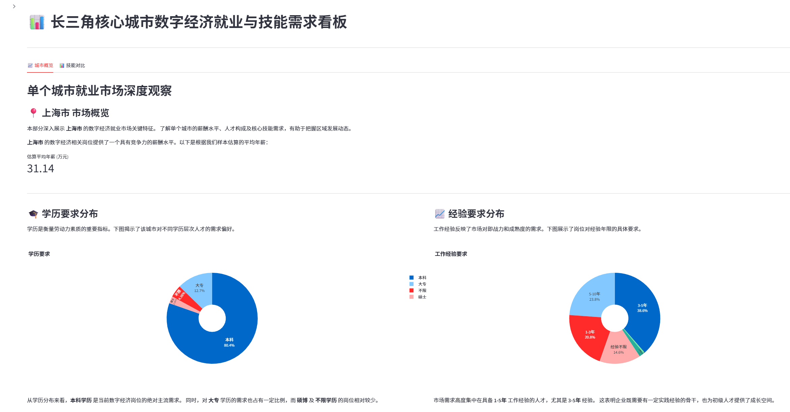
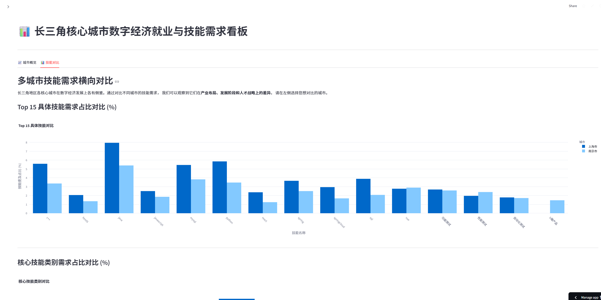

# 📈 基于多源数据融合的就业市场分析与可视化看板

本项目是 **2025年全国大学生统计建模大赛** 的参赛作品，旨在通过融合宏观统计数据与网络招聘微观数据，深入分析长三角核心城市（上海、杭州、苏州、南京、宁波）在数字经济背景下的就业效应与技能需求。

最终成果以一个**交互式 Streamlit Web 应用**呈现，实现了对就业市场数据的多维度可视化探索。

## 🚀 在线演示

**点击下方链接，即可在线访问并体验本项目的数据看板：**

[**https://djtu-zhangmengang.streamlit.app/**](https://djtu-zhangmengang.streamlit.app/)

## 📸 应用截图

 


## ✨ 主要功能

* **城市概览**:
    * 动态展示 **单个城市** 的估算平均年薪。
    * 通过交互式饼图展示**学历要求**和**经验要求**的分布。
    * 通过条形图展示需求**Top 10 的具体技能**。
    * 通过饼图展示**核心技能类别**（后端、前端、大数据、AI等）的整体分布。
* **技能对比**:
    * 支持 **多城市选择** 进行横向比较。
    * 通过**分组柱状图**对比不同城市在 Top 15 具体技能上的需求**占比**。
    * 通过**分组柱状图**对比不同城市在核心技能类别上的需求**占比**。

## 🛠️ 技术栈

* **数据处理与分析**: Python, Pandas
* **Web 应用框架**: Streamlit
* **数据可视化**: Plotly Express
* **数据采集**: Web Scraping (概念)
* **代码管理**: Git, GitHub
* **部署**: Streamlit Cloud

## 📊 数据来源

* **宏观数据**: 长三角核心五市 2013-2023 年官方统计年鉴及相关数据库。
* **微观数据**: BOSS 直聘平台 2025 年 4 月采集的约 4400+ 条核心数字岗位招聘信息。

## 本地运行 (可选)

如果你想在本地运行此应用：

1.  克隆或下载本仓库代码：
    ```bash
    git clone (你的仓库HTTPS链接)
    ```
2.  进入项目目录：
    ```bash
    cd (你的仓库名)
    ```
3.  确保你的数据文件 (`招聘数据_清洗后.csv`, `招聘数据_技能展开.csv`) 与 `dashboard_app.py` 在同一目录。
4.  安装所需的 Python 库：
    ```bash
    pip install -r requirements.txt
    ```
5.  运行 Streamlit 应用：
    ```bash
    streamlit run dashboard_app.py
    ```
6.  应用将在你的浏览器中自动打开。

## 🧑‍💻 作者

* **张梦昂** - 大连交通大学

---
